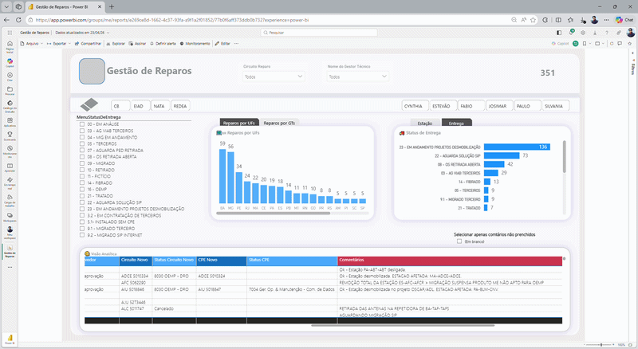
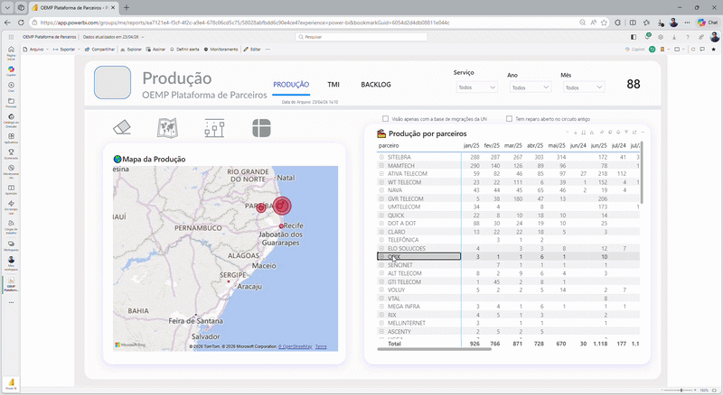

# 👋 Hello, I'm Antonio Estevão Moraes

🎯 Telecom Operations Specialist | Data & Analytics | AI & Automation

📍 Brazil  

---

---

## 🚀 About Me

Telecom Operations Specialist with strong experience in data analysis, automation, and process optimization, focused on improving operational efficiency through data analysis, automation, and process optimization.

I work at the intersection of operations and analytics, supporting decision-making with data-driven insights and performance monitoring.

## 💼 Professional Background

- 25+ years of experience in telecom operations  
- Experience in operational management and performance monitoring  
- Strong background in SLA, backlog control, and service operations  
- Experience leading and supporting teams and projects through operational and data-driven initiatives.
  
💡 I focus on:
- Improving operational performance (SLA, backlog, MTTR)
- Automating processes and reducing manual workload
- Turning data into actionable insights for decision-making  

---

## 🧠 Tech Stack

### Operations & Performance
- SLA Monitoring  
- Backlog Management  
- Operational KPIs

### Data Science
- Python (pandas, numpy, scikit-learn)
- Machine Learning (Regression, Classification)
- Statistics & Hypothesis Testing  

### Data Analytics
- SQL (Joins, CTEs, Window Functions)
- Power BI (Dashboards, DAX)
- Excel  

### Tools & Engineering
- Git & GitHub  
- VS Code  
- Docker (basic knowledge)  

---

## 🏆 Key Certifications

- 🎓 DataCamp  
  - Associate Data Analyst in SQL  
  - Associate Data Scientist in Python *(in progress)*  

- 🎓 Datab  
  - Formação Completa em Power BI  
  - Power BI Specialist  

- 🎓 Udemy
  -  Estatística para Análise de Dados com Python - Data Scientist. Luciano Galdino
  -  Álgebra Linear com Python para Machine Learning e Modelagem - Data Scientist. Luciano Galdino
  -  Python Data Science: Data Prep & EDA with Python - Data Scientist. Alice Zhao
  -  SQL para Análise de Dados - Midori Toyota
  -  AWS QuickSight: Dashboards Profissionais - Midori Toyota
 
- 🎓 LinkedIn Learning
  -  Fundamentos de Estatística (1,2,3) Eddie Davila

---

# 📈 Operational & Data Projects

---

## 🔹 Repair Operations Dashboard

📊 Nationwide monitoring of repair operations and service performance  

**🔧 Tech:**
- Power BI  
- DAX  
- Data Modeling  

**📈 Key Metrics:**
- Mean Time to Repair (MTTR)  
- Backlog of Open Requests  
- SLA Compliance  
- Performance by Region  

**💡 Highlights:**
- Identification of operational bottlenecks impacting SLA performance 
- Regional performance analysis  
- SLA monitoring enabling faster response to delays  

🔎 **[View Project Details](./projects/powerbi-repair-operations)**

---

## 🔹 CPE Operations Dashboard

📊 Monitoring of telecom equipment lifecycle and service operations  

**🔧 Tech:**
- Power BI  
- DAX  
- Data Modeling  

**📈 Key Metrics:**
- Service Orders (OS)  
- Installations vs Removals  
- Repair Status  
- Scheduling Performance  

**💡 Highlights:**
- CPE lifecycle management  
- Partner performance analysis  
- Repair and scheduling tracking  
- Identification of inefficiencies in equipment lifecycle and operations  
🔎 **[View Project Details](./projects/powerbi-cpe-operations)**

---

## 🔹 Circuit Migration Dashboard

📊 Monitoring the migration of proprietary circuits to partner providers, focusing on SLA, backlog, and operational performance.  

**🔧 Tech:**
- Power BI  
- DAX  
- Data Modeling  
- Power Automate  

**📈 Key Metrics:**
- Total Service Orders (OS)  
- Backlog of Open Orders  
- Mean Time to Install (TMI)  
- SLA Compliance  

**💡 Highlights:**
- Migration performance by partner providers  
- Backlog and delay analysis  
- SLA monitoring and execution time tracking  
- Geographic distribution of service orders  

**⚙️ Automation:**
- Automated distribution of backlog OS to partner providers  
- Priority-based email notifications  
- End-to-end workflow automation (analysis → decision → execution)

**💼 Operational Impact:**
- Reduced manual workload through automation  
- Improved prioritization of service orders  
- Increased operational efficiency and response time

🔎 **[View Project Details](./projects/powerbi-migration-management)**

---

## 🔹 Telecom Revenue Analysis (T-Test)

📊 Analyze whether premium customers generate higher average revenue (ARPU) compared to standard customers  

**💼 Business Impact:**
- Supports strategic decisions on upsell and pricing  
- Enables better customer segmentation based on revenue behavior  

**🔧 Tech:**
- Python, pandas, SciPy, matplotlib  

**📈 Results:**
- Statistically significant difference identified between premium and standard customers  
- Premium segment shows higher average revenue (ARPU)  

**💡 Business Impact:**
- Supports data-driven upsell strategies  
- Helps optimize revenue and customer targeting  

👉 [View Project](https://github.com/aestevaomoraes/t-test-salary-analysis)

---

## 🔹 Telecom Operations Analytics (AI + Automation)

🤖 Automate operational analysis, SLA reporting, and email delivery using AI and prompt engineering  

---

**🔧 Tech:**

- Python, Pandas  
- Prompt Engineering (AI - Antigravity)  
- Automation workflows  
- Email automation (automated report delivery)  

---

**📈 Results:**

- Automated generation of operational reports  
- Automated email delivery of reports 📧  
- Faster SLA analysis and decision support  
- Significant reduction in manual analysis effort  

---

**💡 Business Impact:**

- Improves operational efficiency  
- Enables real-time and consistent reporting  
- Reduces manual workload in report distribution  
- Supports faster, data-driven decision-making in telecom operations    

👉 [View Project](https://github.com/aestevaomoraes/projeto-analise-bd-online)

---

## 🔹 Google Analytics Revenue & Conversion Analytics with BigQuery

📊 Business-oriented analytics project transforming nested Google Analytics data into actionable business insights using BigQuery SQL.

**🔧 Tech:**
- Google BigQuery
- SQL
- ARRAY
- STRUCT
- UNNEST()
- CTEs

**📈 Key Analyses:**
- Revenue Analysis
- Conversion Analysis
- Landing Page Performance
- Acquisition Channel Performance
- Device Conversion Analysis
- User Engagement Analysis

**💡 Highlights:**
- Analysis of nested Google Analytics datasets
- Practical use of ARRAY, STRUCT and UNNEST
- Revenue attribution and conversion insights
- Business-focused analytics and storytelling
- Professional project documentation and architecture design

**🏆 Business Insights:**
- Referral channels achieved the highest conversion efficiency
- Homepage was the primary revenue entry point
- Desktop users generated most purchasing sessions
- Traffic volume did not necessarily translate into conversions

👉 [View Project](https://github.com/aestevaomoraes/google-analytics-revenue-conversion-analysis)

---
## 🔹 Looker Studio + BigQuery Dashboard

☁️ Modern cloud-based Business Intelligence solution using Google BigQuery and Looker Studio.

**🔧 Tech:**
- Google BigQuery
- Looker Studio
- SQL
- Cloud Analytics

**📈 Features:**
- Interactive dashboard
- KPI cards
- Cloud-based analytics
- SQL Views
- Calculated Fields
- Dynamic filters

**💡 Highlights:**
- Fully cloud-native BI solution  
- Professional dashboard design  
- BigQuery + Looker Studio integration  
- Modern alternative to desktop BI tools  
- SQL transformations and business rules implementation  

👉 [View Project](https://github.com/aestevaomoraes/looker-studio-bigquery-dashboard)
---

## 📊 GitHub Stats

  
  
  

---

## 📫 Contact

💬 Feel free to reach out — I’m open to opportunities and collaborations.
- LinkedIn Preferred contact: [Antonio Neto](https://www.linkedin.com/in/antonio-neto-09518686/)
  
- Email (secondary): aestevao@gmail.com  

---

## 🎯 Career Goal

To work in data-driven roles, delivering measurable business impact through analytics, automation, and machine learning.
