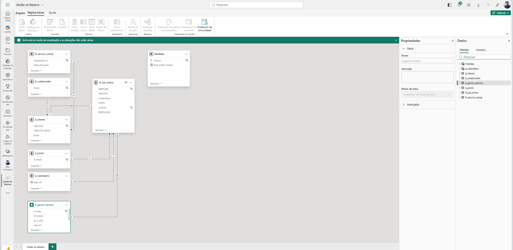

# 📊 Power BI Dashboard – Business Analysis

## 🎯 Objective

Develop an interactive dashboard to support business decision-making through data visualization.

---

## 📊 Dashboard Preview

## 🧩 Data Model

---

## 🧠 Context

Due to data privacy and company policies, the dataset cannot be shared.

This project demonstrates real-world dashboard development applied in a business environment.

---

## 🔧 Tools & Techniques

- Power BI  
- DAX  
- Data Modeling  
- KPI Design  
- Data Visualization  

---

## 📈 Key Features

- Interactive filters  
- KPI tracking  
- Drill-down analysis  

---

## 💡 Business Value

- Improved decision-making  
- KPI visibility  
- Business performance insights  

---

## 🔒 Data Disclaimer

The dataset is not publicly available due to confidentiality.
