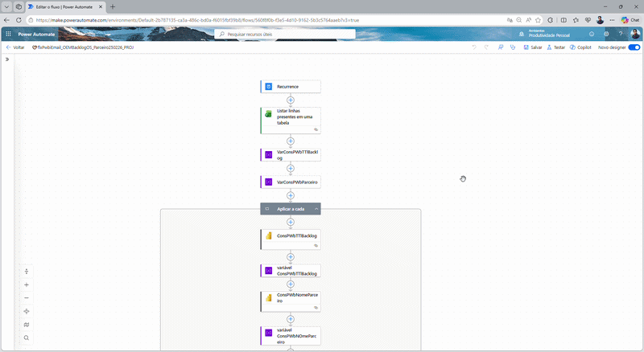

# 🔄 Circuit Migration to Partner Providers Dashboard

## 🎯 Objective

Monitor and manage the migration of proprietary circuits to partner providers, ensuring operational efficiency, SLA compliance, and visibility across the migration lifecycle.

---

## 📊 Dashboard Preview

---

## 🧩 Data Model

This model follows a star schema structure optimized for operational and performance analysis.

---

## ⚙️ Automation – Power Automate

This project includes an automated workflow built with Power Automate to operationalize the migration process.

### 🔄 What the automation does

- Extracts backlog data from the migration dashboard  
- Identifies all pending service orders (OS) by partner provider  
- Prioritizes orders based on business rules (priority first)  
- Groups service orders by partner  
- Sends automated and personalized emails to each provider  

### 📧 Email Distribution Logic

- Each partner receives only their own pending service orders  
- Orders are sorted by priority and urgency  
- The email contains a structured list of OS for execution  

### 🚀 Business Impact

- Eliminates manual follow-up process  
- Ensures faster communication with partners  
- Reduces operational delays  
- Improves SLA compliance  

### 🧠 What this demonstrates

- Integration between Power BI and Power Automate  
- End-to-end data workflow (analysis → action)  
- Real-world process automation  

## 🧠 Business Context

This dashboard supports the management of circuit migration from internal infrastructure to partner providers.

It provides a comprehensive operational view, enabling tracking of service orders (OS), performance monitoring, and identification of bottlenecks across different dimensions such as partners, clients, and regions.

---

## 🔧 Tools & Techniques

- Power BI  
- DAX  
- Data Modeling  
- KPI Design  
- SLA Monitoring  

---

## 📈 Key Metrics

- Total Service Orders (OS)  
- Completed Orders (Production)  
- Open Orders (Backlog)  
- Mean Time to Install (TMI)  
- SLA Compliance Rate  
- Distribution of TMI  

---

## 💡 Key Features

- 📊 Production View (executed service orders)  
- ⏳ Backlog Analysis (pending orders)  
- ⏱️ TMI Analysis (average execution time)  
- 🗺️ Geographic visualization of service orders  
- 🤝 Performance by partners and third-party providers  
- 👥 Client-level analysis  
- 📈 TMI distribution (%)  
- 🔍 Detailed drill-down across all reports  
- 🚨 Priority vs non-priority orders analysis  

---

## 💡 Key Insights

- Identification of delays in migration process  
- Performance differences between partner providers  
- Backlog concentration in specific regions  
- Impact of priority orders on SLA performance  

---

## 🚀 Business Impact

- Improved control over migration operations  
- Better SLA tracking and compliance  
- Enhanced decision-making for partner allocation  
- Increased operational efficiency  

---

## 🔒 Data Disclaimer

The dataset is not publicly available due to confidentiality and data protection policies.
