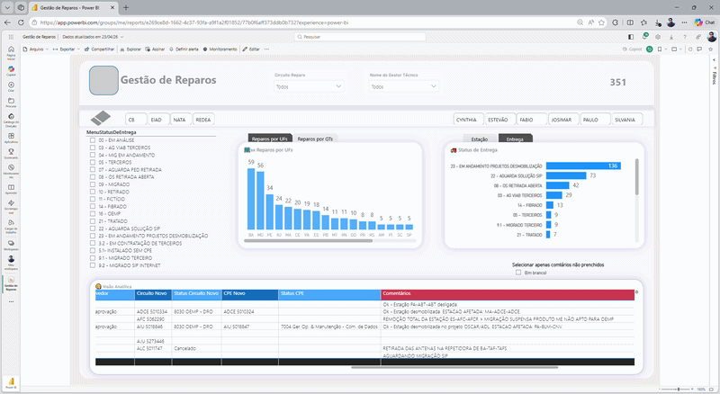

# 🔧 Repair Operations Dashboard

## 🎯 Objective

Monitor and analyze repair operations to improve efficiency, reduce delays, and optimize resource allocation.

---

## 📊 Dashboard Preview

## 🧩 Data Model

---

## 🧠 Business Context

This dashboard was developed to support operational teams in tracking repair activities, identifying bottlenecks, and improving service performance.

Due to data privacy policies, the dataset cannot be shared.

---

## 🔧 Tools & Techniques

- Power BI  
- DAX  
- Data Modeling  
- KPI Design  

---

## 📈 Key Metrics

- Number of repairs completed  
- Average repair time  
- Delay rate  
- Performance by region / team  

---

## 💡 Key Insights

- Identification of delays in specific regions  
- Teams with higher efficiency  
- Seasonal variation in repair demand  

---

## 🚀 Business Impact

- Improved operational visibility  
- Faster decision-making  
- Better resource allocation  

---

## 🔒 Data Disclaimer

The dataset is not publicly available due to confidentiality.
